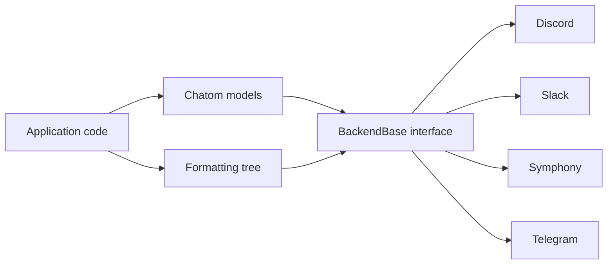

# The unified frontend

Chat platforms disagree on identifiers, markup, threading, presence, interactions, and supported operations. Chatom keeps those differences at the backend boundary. Application code works with one set of models and operations, then a selected backend translates them to a platform API.

## One application vocabulary

{class}`chatom.User`, {class}`chatom.Channel`, {class}`chatom.Message`, {class}`chatom.Thread`, and related models describe concepts shared by chat systems. Platform packages subclass those models when an API exposes additional information. Code that only needs the common fields can remain unaware of the concrete backend.

The same split applies to operations. {class}`chatom.BackendBase` defines connection, lookup, history, sending, event streaming, and optional chat operations. Discord, Slack, Symphony, and Telegram backends present that common interface while retaining their platform-specific configuration and models.

## Formatting at the boundary

Rich text is represented as a tree of nodes such as {class}`chatom.Bold`, {class}`chatom.Link`, {class}`chatom.Table`, and {class}`chatom.UserMention`. Rendering is delayed until the destination is known. This preserves intent: a bold node can become Slack mrkdwn, Discord Markdown, MessageML, or Telegram HTML without platform conditionals in message-building code.

Interactive components and embeds follow the same rule. A {class}`chatom.format.Button` or {class}`chatom.format.FormattedEmbed` retains structure and produces a backend payload only when requested.

## Capabilities make differences explicit

A unified interface does not imply that every platform supports every operation. Each backend exposes {class}`chatom.BackendCapabilities`. Integrations use those declarations to omit unsupported tools or choose a fallback.

Required backend methods cover the minimum lifecycle and messaging contract. Reactions, editing, presence, file transfer, interactions, channel management, and other operations are capability-dependent. Applications can share their main path while handling a platform difference where it matters.

## Conversion and bridging

Base models can be promoted to backend-specific types and demoted again with {func}`chatom.promote` and {func}`chatom.demote`. For live cross-platform forwarding, {class}`chatom.MessageBridge` converts formatting, maps channels, carries attachments, and can translate mentions through {class}`chatom.IdentityMapper`.

The agent, MCP, and CSP integrations sit above the same boundary. They expose Chatom operations rather than binding directly to a platform SDK, so changing the backend does not require changing the integration's vocabulary.
